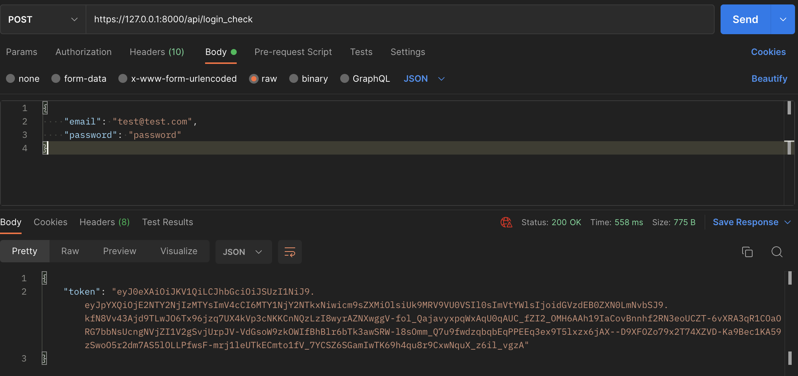
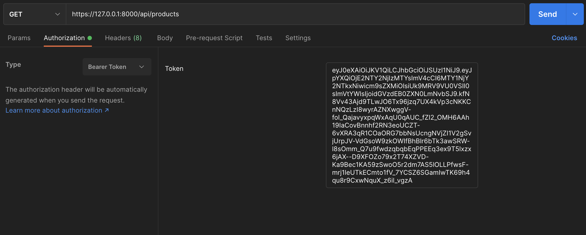

# BileMo

BileMo api vous offre une liste de tous ses produits ainsi qu'une gestion de vos clients

## Installation

Modifier le fichier .env pour mettre un lien vers votre BDD ligne 31

1) Installez les bundles
```bash
composer install
```

2) Créez votre base de données
```bash
php bin/console doctrine:database:create
```

3) Créez vos tables
```bash
php bin/console doctrine:migrations:migrate
```

4) Créez des données 
```bash
php bin/console doctrine:fixture:load
```

5) Générez les clés SSL
```bash
php bin/console lexik:jwt:generate-keypair
```


## Usage

Votre compte de test sera:

email: test@test.com  
mot de passe: password

Toutes vos requêtes à l'api doivent être protégées par un token générer via la route:  

`POST`: /api/login_check  
avec en body (json) votre email et votre mot de passe

  

Ce token devra être dans vos autorisations en tant que Bearer Token dans chacune de vos requêtes  
Notez que le token générer est valable 1 heure

  


# Les différentes requêtes

## Produit

`GET`: /api/products  

Liste tous les produits

`GET`: /api/products/{id}

Détaille un produit

## Client

`GET`: /api/customers

Liste vos clients

`GET`: /api/customers/{id}

Détaille un client

`POST`: /api/customers

Crée un client

```bash
#Champs à précisez dans le body
{
  "firstname": "prenom",
  "lastname": "nom",
  "email": "client@test.com",
  "phone": "0600000000"
}
```

`PUT`: /api/customers/{id}

Modifie un client

```bash
#Champs à précisez dans le body
{
  "firstname": "prenom",
  "lastname": "nom",
  "email": "client@test.com",
  "phone": "0600000000"
}
```

`DELETE`: /api/customers/{id}

Supprime un client